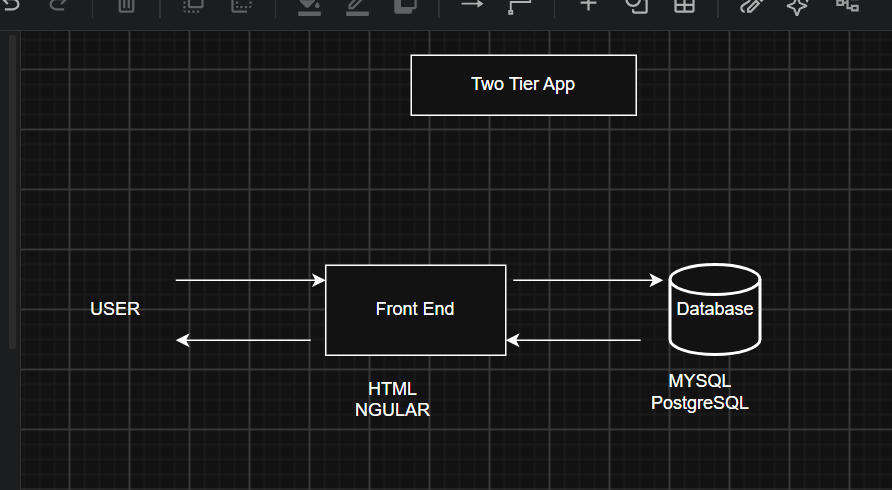

# Week 00 - Internet and Networking

Part of the DevOps Micro Internship (DMI) Cohort 3 with Agentic AI

---

# 🧑‍💻 Task 1: Using ChatGPT as Your Learning Assistant

## Scenario

You're new to DevOps and will frequently encounter technical questions. ChatGPT can be your learning companion.

## Your Task

Write a clear ChatGPT prompt to help you understand:

> "What is a protocol in networking? Explain with a simple real-life example."

Take a screenshot of your interaction showing:

* Your detailed prompt (with clear expectations)
* ChatGPT's simplified response with an example

## Screenshot

Save your screenshot in the `screenshots` folder and update the file name below.


---

## What I Learned (2–3 lines)

ChatGPT is very important when learning new skills you are not awaare of and it explain concept precisely given a clear prompt.

---

# 🌐 Task 2: Internet and Networking

## Scenario

Your friend is launching an online bookstore named **EpicReads**.

He asked you to explain how users globally can access his website hosted in Finland.

## Your Task

Write a short explanation (**100–150 words**) that includes:

* Packet Switching
* IP Address
* TCP/IP
* HTTP/HTTPS


## Answer

Packet swithing break data being sent over the internet into packets because the data is huge.
IP Address, every device connected and communicating over the internet is assigned an IP address which identifies it and where the data should go.
TCP/IP, is a commonly protocol used for devices sending and recieving data over the internet.
HTTP/HTTPS is acommon protocol used by web browsers communicating over the internet where HTTP is less secure while HTTPS uses TLS and make it secure and not easy to intercept it's data because it's encrypted.

---

# 🏗️ Task 3: Application Architecture & Stack

## Scenario

EpicReads bookstore has two application versions:

### Two-Tier Application

* Frontend
* Database

### Three-Tier Application

* Frontend
* Backend
* Database

## Your Task

* Draw simple diagrams (hand-drawn or tool-based such as draw.io)
* Label each layer clearly
* List at least two common technologies or tools used for each layer
* Submit a screenshot or photo clearly showing your own drawing

## Diagram Screenshot / Photo

Save your diagram image in the `screenshots` folder and update the file name below.




---

## Technologies Used

### Frontend

HTML
ANGULAR
CSS

### Backend

DJANGO
NODE.JS
SPRINGBOOT

### Database

MYSQL
PostgreSQL

---

# 🌍 Task 4: Domain Name & DNS (Basic Concepts)

## Scenario

Your friend's bookstore **EpicReads** is currently accessible through:

```text
52.172.142.222:3000
```

He purchased the domain:

```text
epicreads.com
```

## Your Task

In **50–100 words**, explain in your own words:

1. What is DNS (Domain Name System)?
2. Which DNS record type should be used to connect the domain to the given IP, and why?

## Answer

Domain Name System is like the Internet phonebook. It translates domains in human readable form. The epicreads.com domain should use the A record which will help to map the domain to IPv4 address and people trying to access the domain will be directed to the correct server.

---

# 💻 Task 5: Visual Studio Code Setup (Hands-on)

## Your Task

Install Visual Studio Code (if not already installed).

Take a screenshot of your VS Code environment showing:

* Terminal open inside VS Code
* Running a basic command:

### Windows

```powershell
dir
```

### Linux / macOS

```bash
pwd
ls
```

* Your selected VS Code theme clearly visible

⚠️ **Important:** The screenshot must show your username or another identifiable detail to confirm it is your environment.

## Screenshot

Save your screenshot in the `screenshots` folder and update the file name below.


---

# 🔗 Task 6: Publish Your Assignment as a LinkedIn Post

## Objective

Publishing on LinkedIn helps you:

* Build your professional online presence
* Reinforce your learning
* Document your DevOps journey publicly

## Your Task

Summarize your answers from Tasks 1–5 into a LinkedIn post.

Clearly structure your post into the following sections:

* ChatGPT
* Internet & Networking
* App Architecture
* DNS
* VS Code Setup

Add the following credit note at the end of your post:

> **P.S. This post is part of the DevOps Micro Internship (DMI) with Agentic AI — Cohort 3 — by Pravin Mishra. My graded progress is public: https://dmi.pravinmishra.com/s/YOUR-GITHUB-USERNAME.html · Start your DevOps journey: https://dmi.pravinmishra.com/?utm_source=student&utm_medium=ps-linkedin&utm_campaign=cohort3**

---

## LinkedIn Post URL

Paste your LinkedIn post URL here:

```text
https://lnkd.in/p/dKqFirFE
```

---

## LinkedIn Post Backup Copy

My DevOps Learning Journey 
Another step forward in my DevOps learning journey! This phase focused on understanding the foundations that connect applications, servers, and users.
Internet & Networking – Learned how protocols, IP addressing, routing, and packet switching enable communication across networks.

DNS – Explored how domain names are translated into IP addresses and why DNS is essential for making applications accessible and reliable.

Application Architecture – Reviewed two-tier and three-tier architectures and how understanding application structure helps with deployment, scalability, and reliability.
VS Code & Terminals – Set up VS Code for DevOps workflows and worked with both PowerShell and Bash, building familiarity with essential command-line environments.
AI Tools – Explored how tools like ChatGPT can support learning, troubleshooting, documentation, and productivity.
Every concept is another building block toward becoming a stronger DevOps Engineer. 

P.S. This post is part of the DevOps Micro Internship (DMI) — Self-Paced Engineer Track — by Pravin Mishra. My graded progress is public: https://lnkd.in/de3Gi_UP Start your DevOps journey: https://lnkd.in/db6CTVeD
#DevOps #DevOpsJourney #Networking #DNS #CloudComputing #Linux #PowerShell #Bash #VSCode #LearningInPublic #TechJourney

---

# Reflection – Week 0

### What did you find easy?

Internet and Networking

---

### What was difficult?

Two-tier and Three-tier Architecture diagrams. Dealing with Draw.io

---

### What will you improve next week?

I will familiarize myself with drawing tools

---

## 📌 About DMI & CloudAdvisory

DevOps Micro Internship (DMI) is a project-based DevOps program run by Pravin Mishra (The CloudAdvisory) focused on real-world execution, systems thinking, and career readiness.

It helps learners build strong DevOps foundations with hands-on experience.


## 📌 Resources

- 🌐 **DMI Official Website:** https://dmi.pravinmishra.com?utm_source=github&utm_medium=readme  
- 🎓 **University:** https://university.pravinmishra.com?utm_source=github&utm_medium=readme  
- 💬 **Discord Community:** https://discord.pravinmishra.com?utm_source=github&utm_medium=readme  
- 📝 **Blog:** https://dmi.pravinmishra.com/blog?utm_source=github&utm_medium=readme  
- ▶️ **YouTube Playlist (DMI Cohort 3):** https://www.youtube.com/playlist?list=PLFeSNDtI4Cho  
- 🔗 **Pravin Mishra (LinkedIn):** https://www.linkedin.com/in/pravin-mishra-aws-trainer/  
- 🏢 **CloudAdvisory (LinkedIn):** https://www.linkedin.com/company/thecloudadvisory/

---

*This submission is part of DevOps Micro Internship (DMI) Cohort 3 — Agentic AI Track*