# Assignment 3 — Production Maintenance Drill (OPS Checklist)

Part of the DevOps Micro Internship (DMI) Cohort 3 with Agentic AI

---

## Purpose

In this assignment, you will treat your already deployed React application (on Ubuntu VM with Nginx) as a live production system. You will perform structured operational checks covering network validation, service health, log analysis, resource monitoring, configuration verification, and incident simulation with recovery — mirroring real on-call DevOps responsibilities.

---

# Task 1 — Server Access & Networking Validation

## Goal

Verify that the deployed React application is reachable from the browser and confirm basic network connectivity of the Ubuntu VM.

### Evidence

#### Screenshot 1 — Browser showing the React app with your Full Name visible on the UI

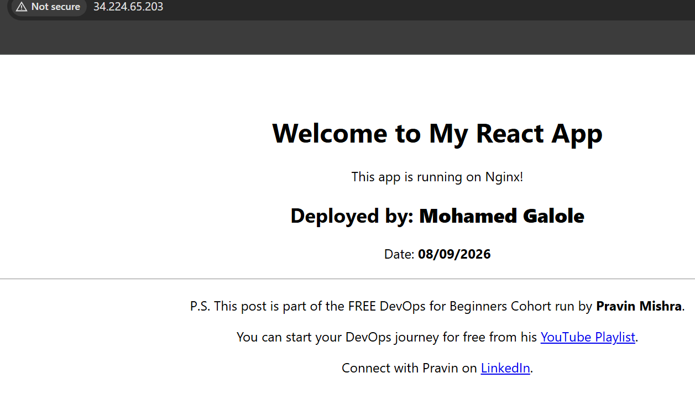

---

#### Screenshot 2 — Output of `ip a`

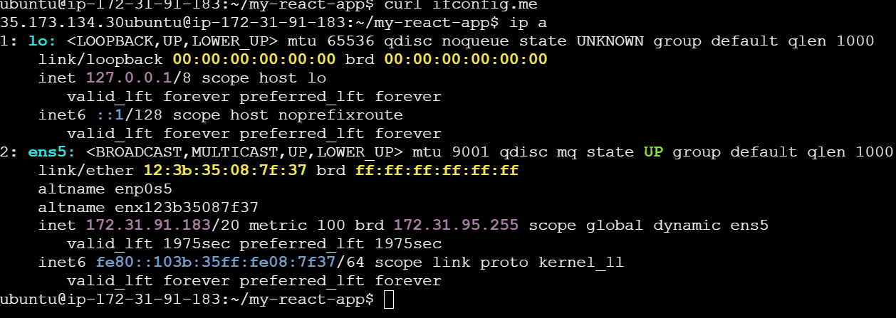

---

#### Screenshot 3 — Output of `sudo ss -tulpen`

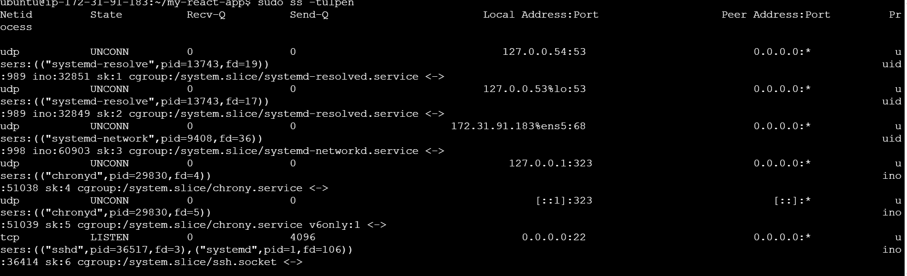

---

#### Screenshot 4 — Output of `sudo ufw status`

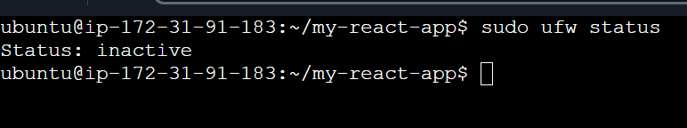

---

### Notes

Answer the following in your own words:

**1. What proves Nginx is listening on 0.0.0.0:80?**
The nginx-test output shows Nginx bound to 0.0.0.0:80, meaning it is listening for HTTP connections on port 80 on all IPv4 network interfaces. This confirms that the Nginx web server is actively listening for incoming HTTP traffic.

---

**2. What proves SSH is active on port 22?**

The port information shows SSH listening on port 22. This proves that the SSH service is active and ready to accept SSH connections.

---

**3. Did you find any unexpected open ports? Explain briefly.**

Write your answer here.

---

# Task 2 — Service Health & Systemd Validation (Nginx)

## Goal

Verify that Nginx is properly installed, running, enabled at boot, and safely configured.

### Evidence

#### Screenshot 1 — Output of `systemctl status nginx --no-pager`

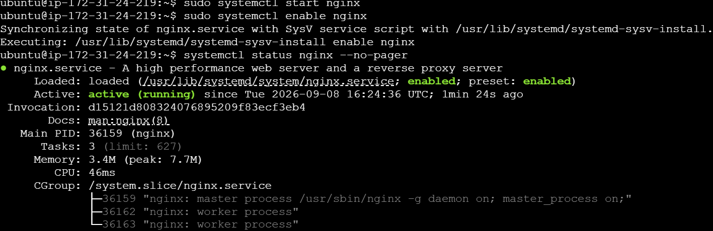

---

#### Screenshot 2 — Output of `sudo nginx -t`

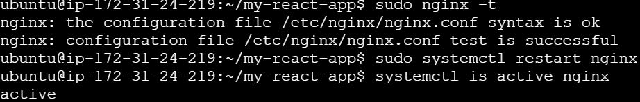

---

#### Screenshot 3 — Output of `sudo ss -lptn '( sport = :80 )'`

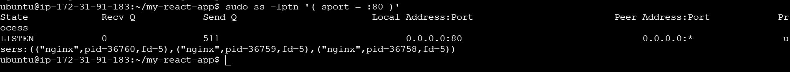

---

### Notes

Answer the following in your own words:

**1. What happens if Nginx fails to restart in production?**

If Nginx fails to restart in production, the website may become unavailable, causing users to receive connection errors or failed requests.

---

**2. What's your basic rollback plan?**

I would verify the Nginx configuration with nginx -t command, and restart Nginx. Then I would test the website locally and from the browser to confirm the previous is working again.

---

# Task 3 — Logs & Request Trace

## Goal

Verify real traffic flow and analyze logs to understand system behavior and errors.

### Evidence

#### Screenshot 1 — Output of `sudo tail -n 30 /var/log/nginx/access.log`

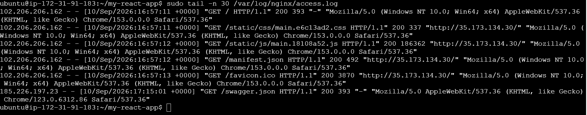

---

#### Screenshot 2 — Output of `sudo tail -n 30 /var/log/nginx/error.log`

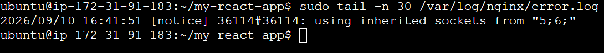

---

#### Screenshot 3 — Output of `sudo journalctl -u nginx --no-pager -n 50`

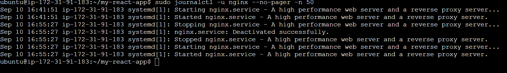

---

### Notes

Answer the following in your own words:

**1. Were there any errors in the logs?**

- If yes, mention 1–2 example error lines from the logs and explain what each one means in simple terms.
- If no, explain what it means if the error log is empty or shows no recent errors during your check.

Yes. There were configuration-related errors shown during the Nginx testing stage. The configuration test initially reported an error. This means Nginx could not accept the configuration in its current form and needed to be corrected before the service could be restarted successfully.

---

**2. If there were no errors, what does that indicate about the system?**

After the configuration was corrected, the successful Nginx test indicates that the current Nginx configuration was valid.

---

**3. Based on the access logs, were your curl requests visible in the log entries? What does that prove about traffic flow?**

Yes. The access-log shows entries generated by the requests made during testing with curl. This proves that the requests were reaching the Nginx web server and being processed. Traffic was successfully flowing from the client to Nginx, rather than failing before reaching the web server.

---

# Task 4 — System Resource Health Check (Capacity Red Flags)

## Goal

Assess server capacity and detect potential performance or failure risks.

### Evidence

#### Screenshot 1 — Output of `uptime`

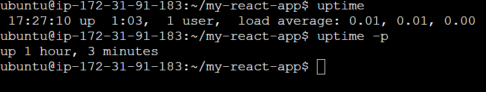

---

#### Screenshot 2 — Output of `free -h`

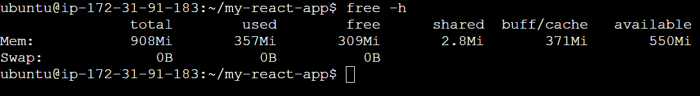

---

#### Screenshot 3 — Output of `df -h`

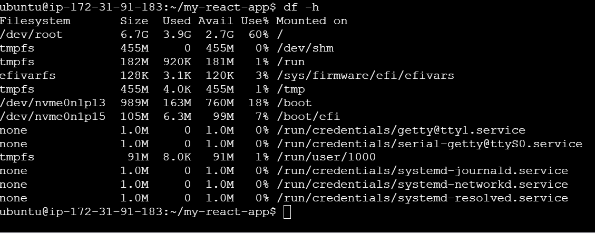

---

#### Screenshot 4 — Output of `sudo du -sh /var/* | sort -h`

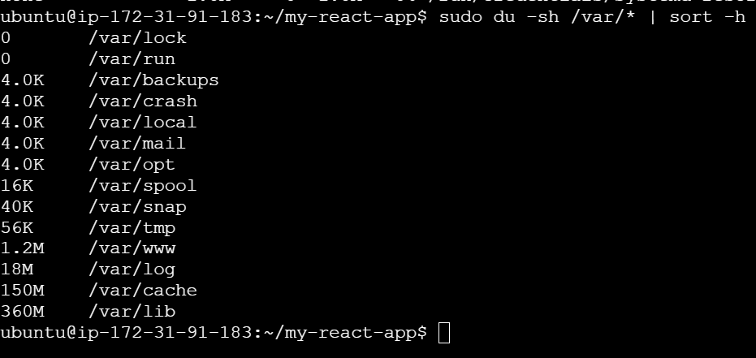

---

### Notes

Answer the following in your own words:

**1. Which resource looks most critical right now? (CPU/load, memory, or disk) Explain why.**

The df output shows that the disk is being used but is not close to 100%, so there is currently no immediate disk-space problem. CPU/load and memory also appear to have sufficient available capacity based on the uptime and free checks.

---

**2. What happens if disk becomes 100% full in a production server?**

If the disk becomes 100% full, the server may no longer be able to write files. This can cause Nginx and other services to fail, logs may stop being written, deployments can fail, and applications may become unavailable.

---

# Task 5 — Configuration & Deployment Verification

## Goal

Ensure the correct React build is deployed and Nginx is serving it properly.

### Evidence

#### Screenshot 1 — Output of `ls -lah /var/www/html | head -n 20`

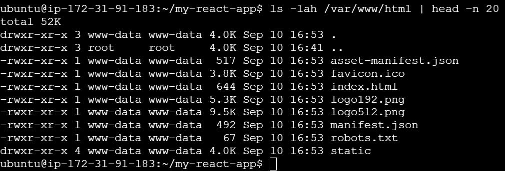

---

#### Screenshot 2 — Output of `grep -R "Deployed by" -n /var/www/html 2>/dev/null | head`

Add your screenshot here.

---

#### Screenshot 3 — Output of `grep -n "try_files" /etc/nginx/sites-available/default`

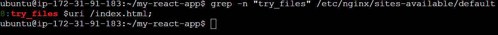

---

### Notes

Answer the following in your own words:

**1. How do you confirm that the correct version of the application is deployed?**

I confirm that the correct version of the application is deployed by checking the application files in the Nginx web root and opening the application in a browser.

---

# Task 6 — Nginx Configuration Failure Simulation

## Goal

Simulate a real-world Nginx misconfiguration and recover the service safely.

### Evidence

#### Screenshot 1 — Output of `sudo nginx -t` showing the syntax error (broken config)

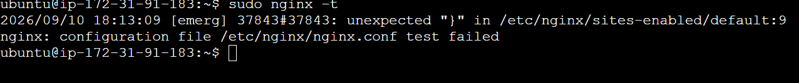

---

#### Screenshot 2 — Output of `sudo nginx -t` showing syntax ok (fixed config)

---

#### Screenshot 3 — Output of `curl -I http://<public-ip>` confirming recovery (200 OK)

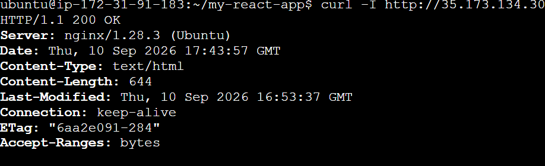

---

### Notes

Answer the following in your own words:

**1. What caused the configuration failure?**

Write your answer here.

---

**2. How did you fix the issue?**

Write your answer here.

---

**3. How can you avoid this kind of issue in real production systems?**

Write your answer here.

---

# Task 7 — Web Application Failure Simulation

## Goal

Simulate missing deployment content and recover the application safely.

### Evidence

#### Screenshot 1 — Output of `curl -I http://<public-ip>` showing failure (non-200 response)

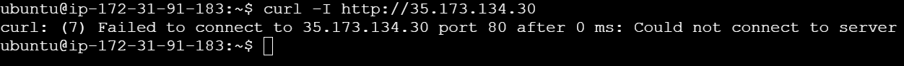

---

#### Screenshot 2 — Output of `curl -I http://<public-ip>` confirming recovery (200 OK)

---

### Notes

Answer the following in your own words:

**1. What caused the application to break in this scenario?**

The configuration failure was caused by an error in the Nginx configuration file. Because of the incorrect configuration, Nginx's configuration test (nginx -t) reported an error and the configuration could not be loaded successfully.

---

**2. How did you fix the issue and restore the application?**

I reviewed and corrected the Nginx configuration, then ran nginx -t again to verify it. After the configuration test returned successfully, I restarted Nginx and confirmed that the website was working.

---

**3. What steps would you take to prevent this kind of issue in real production systems?**

In production, I would always test the Nginx configuration with nginx -t before restarting the service. I would also keep backups of working configuration files and make changes carefully.

---

# Task 8 — Security & Reliability Review

## Goal

Review and reflect on the security and reliability practices applied during this assignment.

### Security & Reliability Notes

Answer the following in your own words:

**1. Why is SSH key-based authentication more secure than sharing passwords?**

SSH key-based authentication is more secure because it uses a cryptographic key pair instead of a password. The private key stays with the authorized user, while the server stores the public key. This reduces the risk of password guessing and credential sharing.

---

**2. Why should only required ports be open on a production server?**

Only required ports should be open to reduce the attack surface. Every open port can potentially provide an entry point for attackers. Closing unnecessary ports limits exposure and helps protect the server from unauthorized access.

---

**3. Why is it important for Nginx to be enabled on boot?**

Enabling Nginx on boot ensures that the web server automatically starts when the server restarts. Without it, the application could remain unavailable after a reboot until someone manually starts Nginx.

---

**4. What are the risks of sharing secrets, keys, or credentials publicly?**

Publicly sharing secrets, private keys, passwords, or credentials can allow unauthorized people to access servers, applications, or cloud resources. This can lead to data loss, service disruption, or unexpected cloud charges. Secrets should therefore be kept private and securely managed.

---

**5. Why should cloud resources be stopped or terminated when they are no longer needed?**

Unused cloud resources should be stopped or terminated to avoid unnecessary costs and reduce security exposure. Keeping unused servers running can continue generating charges and creates additional systems that need to be secured and maintained.

---

# LinkedIn Post (Required)

## Evidence

#### LinkedIn Post URL

Paste your LinkedIn post URL here:

`https://www.linkedin.com/posts/mohamedgalole_dmi-devops-cloudcomputing-activity-7504085660333547520-Q6rE?utm_source=share&utm_medium=member_desktop&rcm=ACoAADirbaIBlFc8XjO7hntAv73HmZQHdcYtWHw`

---

#### Screenshot — Published LinkedIn post

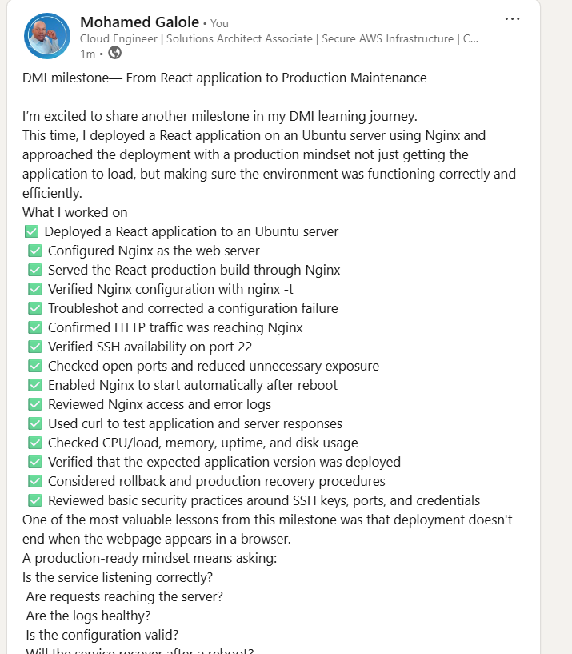

---

# Submission Instructions

- Add all required screenshots in your submission
- Full name must be visible in required screenshots
- Do not expose sensitive information (keys, passwords, account IDs)

---

# Completion Checklist

- [ ] Task 1: Screenshots (browser, ip a, ss -tulpen, ufw status) + Notes answered
- [ ] Task 2: Screenshots (nginx status, nginx -t, ss port 80) + Notes answered
- [ ] Task 3: Screenshots (access log, error log, journalctl) + Notes answered
- [ ] Task 4: Screenshots (uptime, free -h, df -h, du -sh) + Notes answered
- [ ] Task 5: Screenshots (ls html, grep deployed by, grep try_files) + Notes answered
- [ ] Task 6: Screenshots (nginx -t fail, nginx -t pass, curl recovery) + Notes answered
- [ ] Task 7: Screenshots (curl failure, curl recovery) + Notes answered
- [ ] Task 8: Security & Reliability Notes answered
- [ ] LinkedIn post published and URL submitted
- [ ] Full Name visible in all required screenshots
- [ ] No sensitive data exposed

---

## 📌 About DMI & CloudAdvisory

DevOps Micro Internship (DMI) is a project-based DevOps program run by Pravin Mishra (The CloudAdvisory) focused on real-world execution, systems thinking, and career readiness.

It helps learners build strong DevOps foundations with hands-on experience.

---

## 📌 Resources

- 🌐 DMI Official Website: https://dmi.pravinmishra.com?utm_source=github&utm_medium=readme  
- 🎓 University: https://university.pravinmishra.com?utm_source=github&utm_medium=readme  
- 💬 Discord Community: https://discord.pravinmishra.com?utm_source=github&utm_medium=readme  
- 📝 Blog: https://dmi.pravinmishra.com/blog?utm_source=github&utm_medium=readme  
- ▶️ YouTube Playlist: https://www.youtube.com/playlist?list=PLFeSNDtI4Cho  
- 🔗 Pravin Mishra (LinkedIn): https://www.linkedin.com/in/pravin-mishra-aws-trainer/  
- 🏢 CloudAdvisory (LinkedIn): https://www.linkedin.com/company/thecloudadvisory/

---

*This submission is part of DevOps Micro Internship (DMI) Cohort 3 — Agentic AI Track.*