# Assignment 5 — Bash Script Automation Drill (OPS Checklist)

Part of the DevOps Micro Internship (DMI) Cohort 3 with Agentic AI

---

## Purpose

In this assignment, you will practice Bash scripting by building a series of small automation scripts covering environment setup, variables, arrays, loops, file conditionals, if-else logic, and functions. These scripts form the foundation of real-world Linux automation used in DevOps, cloud, and production support environments.

---

# Task 1 — Bash Environment & Workspace Setup

## Goal

Verify that Bash is available on your system and create a clean workspace for this assignment.

### Evidence

#### Screenshot 1 — Output of `echo $SHELL` and `bash --version`

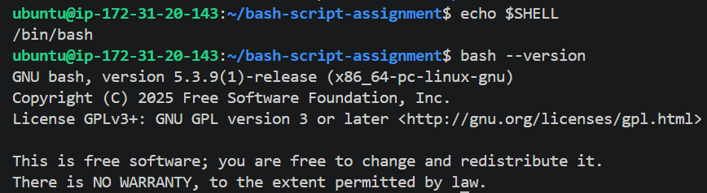
---

#### Screenshot 2 — Output of `pwd` and `ls -lah` showing the scripts directory

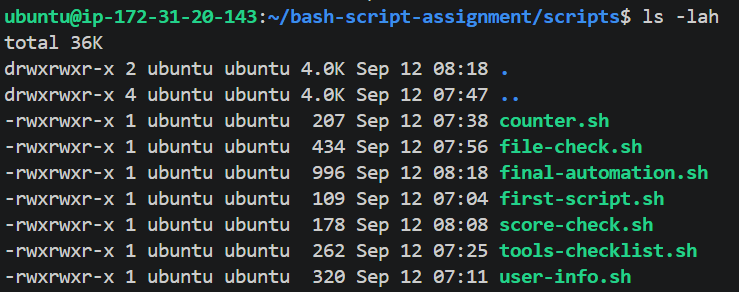

---

### Notes

Answer the following in your own words:

**1. What is Bash?**

Bash is a command-line shell used in Linux and other operating systems. It allows users to run commands, manage files and directories, and create scripts to automate tasks.

---

**2. What is the difference between shell and Bash?**

A shell is a general program that allows users to interact with the operating system through commands. Bash is one specific type of shell.

---

**3. Why is it important to confirm the Bash version before writing scripts?**

It is important to confirm the Bash version because different versions may support different features.

---

# Task 2 — Your First Bash Script

## Goal

Create your first Bash script, make it executable, and run it from the terminal.

### Evidence

#### Screenshot 1 — Content of `first-script.sh`

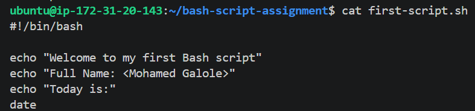

---

#### Screenshot 2 — Output of `./first-script.sh`

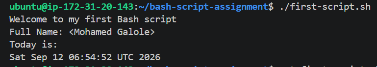

---

#### Screenshot 3 — Output of `ls -l first-script.sh` showing executable permission

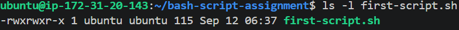

---

### Notes

Answer the following in your own words:

**1. What is the purpose of `#!/bin/bash`?**

#!/bin/bash tells the operating system that the script should be executed using the Bash shell.

---

**2. Why do we use `chmod +x` before running a script?**

chmod +x gives the script execute permission. Without this permission, we may not be able to run the script directly using ./script.sh.

---

**3. What is the difference between running a script using `./script.sh` and `bash script.sh`?**

./script.sh runs the script directly and relies on the shebang to determine which interpreter should execute it. bash script.sh explicitly tells the system to use Bash to run the script, so the script does not need to be executable.

---

# Task 3 — Variables: User Information Script

## Goal

Use variables to store and display user-related information.

### Evidence

#### Screenshot 1 — Content of `user-info.sh`

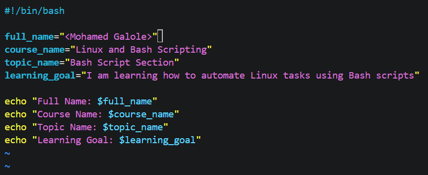

---

#### Screenshot 2 — Output of `./user-info.sh`

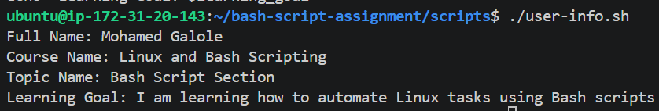

---

### Notes

Answer the following in your own words:

**1. What is a variable in Bash?**

A variable is a named place used to store information, such as a name, number, or file path.

---

**2. Why should we avoid spaces around the `=` sign when creating variables?**

Bash does not allow spaces around = when assigning a value.

---

**3. How do you access the value stored inside a Bash variable?**

We use the $ symbol followed by the variable name.

---

# Task 4 — Arrays & Loops: Tools Checklist Script

## Goal

Use arrays and loops to print a checklist of tools used in Bash scripting.

### Evidence

#### Screenshot 1 — Content of `tools-checklist.sh`

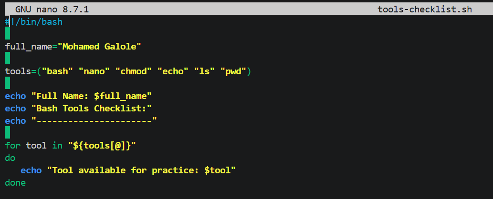

---

#### Screenshot 2 — Output of `./tools-checklist.sh`

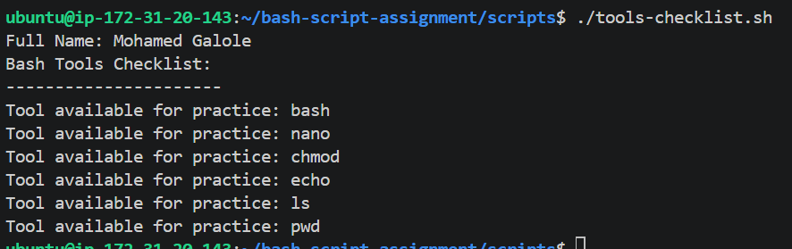

---

### Notes

Answer the following in your own words:

**1. What is an array in Bash?**

An array in Bash is a variable that can store multiple values under one name. Each value can be accessed using its position, called an index.

---

**2. Why are arrays useful in scripts?**

Arrays are useful because they allow us to store and manage multiple related values together.

---

**3. What does `"${tools[@]}"` mean?**

"${tools[@]}" means all the values stored in the tools array. It allows the script to access each array element separately.

---

**4. What is the purpose of the `for` loop in this script?**

The for loop is used to go through each item in the array one at a time and perform the same action on each item. This makes the script shorter and easier to manage.

---

# Task 5 — Loops: Number Counter Script

## Goal

Use loops to repeat a task multiple times.

### Evidence

#### Screenshot 1 — Content of `counter.sh`

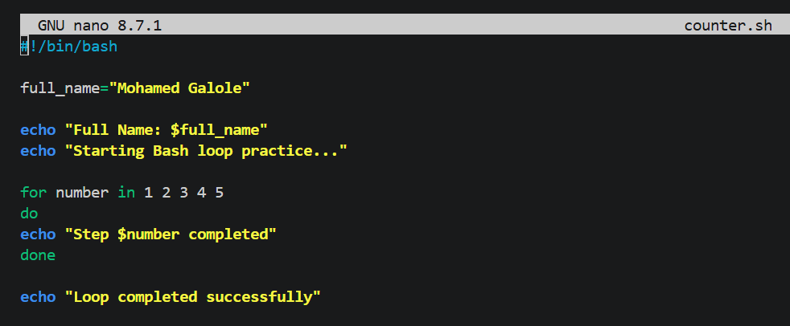

---

#### Screenshot 2 — Output of `./counter.sh`

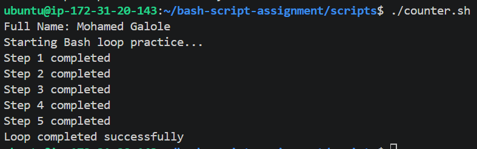

---

### Notes

Answer the following in your own words:

**1. What is a loop?**

A loop is a programming structure that repeats a set of commands multiple times until a specific condition is reached.

---

**2. Why do we use loops in Bash scripting?**

We use loops to repeat tasks automatically without writing the same commands multiple times.

---

**3. How many times did the loop run in your script?**

The loop ran 5 times, once for each number from 1 to 5.
---

**4. What would you change if you wanted the loop to run 10 times?**

I would change the numbers in the loop from 1 to 10.

---

# Task 6 — Files & Conditionals: File Validation Script

## Goal

Use file checks and conditionals to verify whether files and directories exist.

### Evidence

#### Screenshot 1 — Output of `ls -lah ../test-folder`

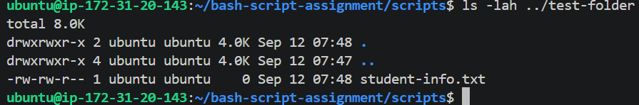

---

#### Screenshot 2 — Content of `file-check.sh`

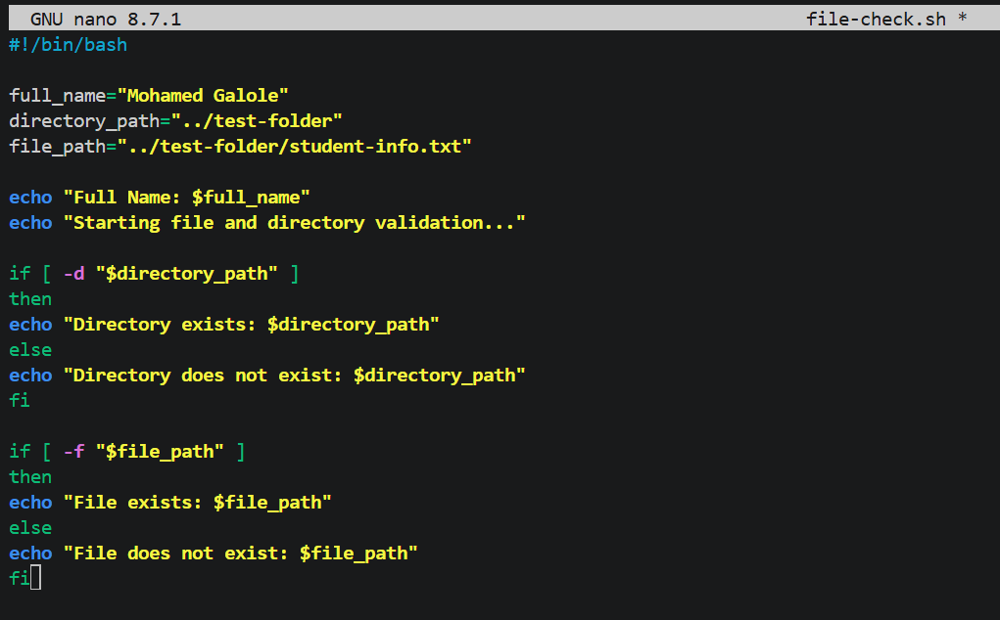

---

#### Screenshot 3 — Output of `./file-check.sh`

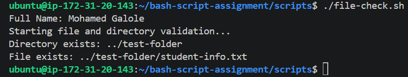

---

### Notes

Answer the following in your own words:

**1. What does `-d` check in Bash?**

-d checks whether a specified path exists and is a directory. If the directory exists, the condition returns true.

---

**2. What does `-f` check in Bash?**

-f checks whether a specified path exists and is a regular file. If the file exists, the condition returns true.

---

**3. Why should file and directory paths be stored in variables?**

Storing paths in variables makes the script easier to read and maintain.

---

**4. What happens if the file does not exist?**

If the file does not exist, the -f condition returns false, so the script executes the else section and displays a message saying that the file does not exist.

---

# Task 7 — Conditionals: Pass or Retry Script

## Goal

Use if-else conditionals to make decisions based on a variable value.

### Evidence

#### Screenshot 1 — Content of `score-check.sh` with `score=85`

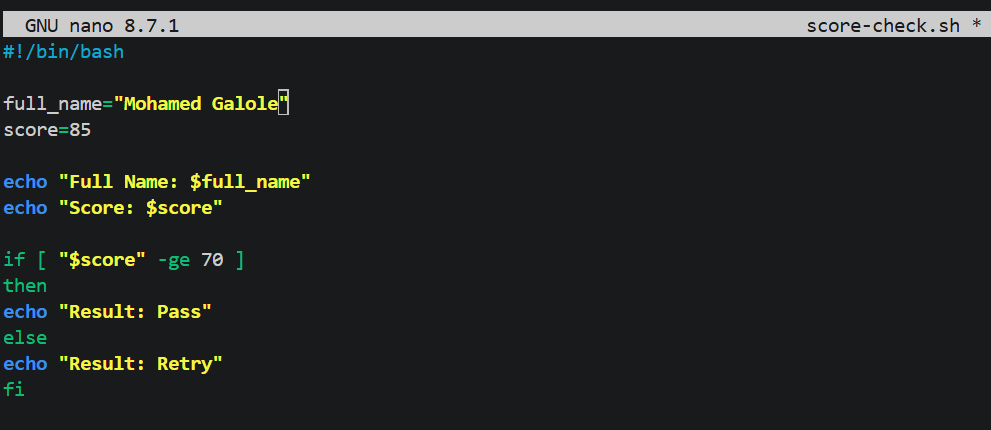

---

#### Screenshot 2 — Output showing `Result: Pass`

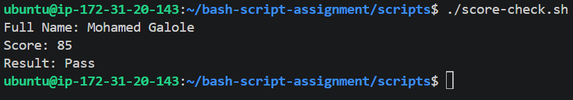

---

#### Screenshot 3 — Content of `score-check.sh` with `score=55`

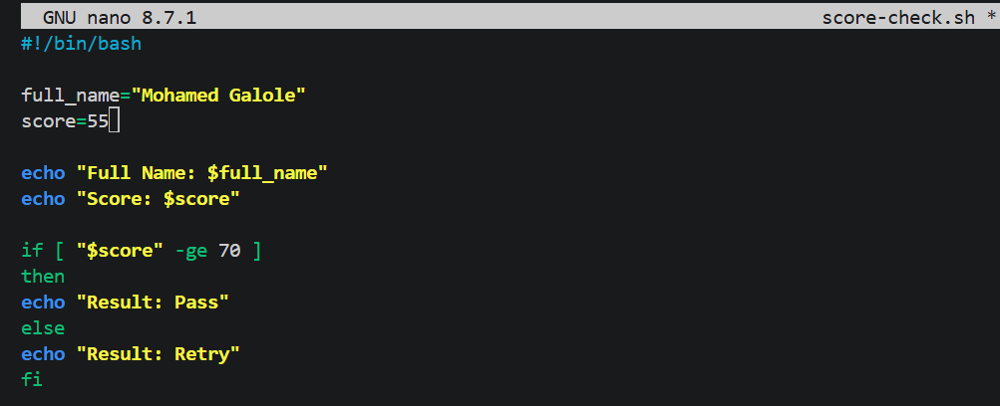

---

#### Screenshot 4 — Output showing `Result: Retry`

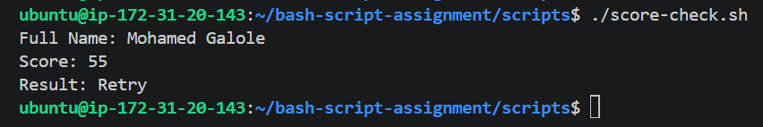

---

### Notes

Answer the following in your own words:

**1. What is the purpose of if-else in Bash?**

if-else is used to make decisions in a Bash script. It allows the script to perform one action when a condition is true and a different action when the condition is false.

---

**2. What does `-ge` mean?**

-ge means greater than or equal to. It is used to compare two numbers.

---

**3. Why should conditions be tested with different values?**

To make sure the script behaves correctly in different situations. This helps identify errors and confirms that both the true and false parts of the condition work as expected.

---

**4. How can conditionals help in automation scripts?**

Conditionals help automation scripts make decisions based on different situations.

---

# Task 8 — Functions: Final Bash Automation Script

## Goal

Create a final Bash script using functions to organize reusable code.

### Evidence

#### Screenshot 1 — Content of `final-automation.sh`

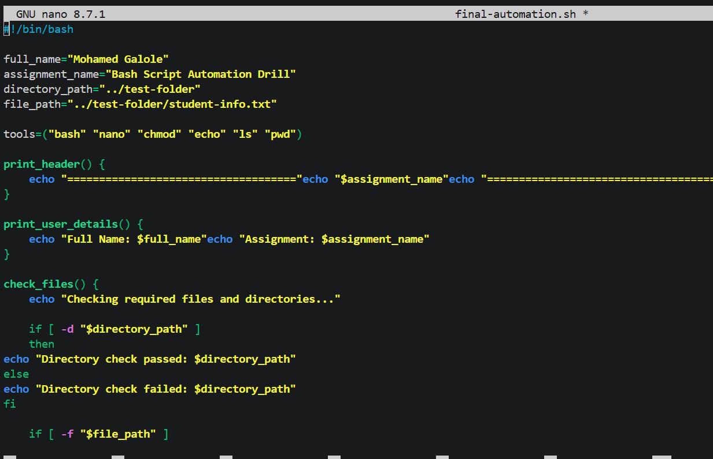

---

#### Screenshot 2 — Output of `./final-automation.sh`

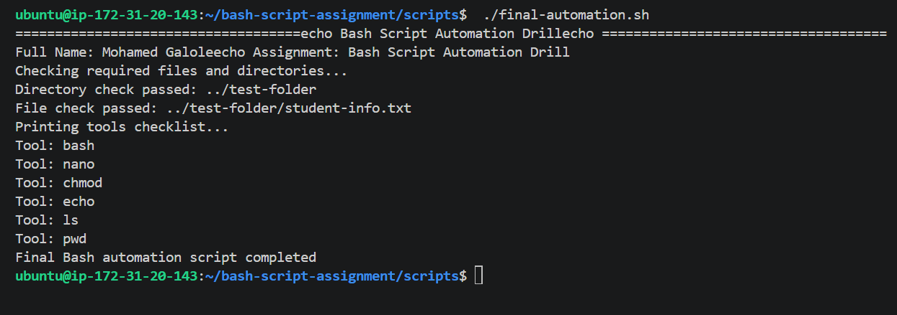

---

#### Screenshot 3 — Output of `ls -lah` showing all created scripts

---

### Notes

Answer the following in your own words:

**1. What is a function in Bash?**

A function in Bash is a named group of commands that performs a specific task. The function can be called whenever we need to perform that task.

---

**2. Why are functions useful in scripts?**

Functions are useful because they allow us to organize commands into reusable sections.

---

**3. Which functions did you create in this script?**

I created four functions: print_header(), print_user_details(), check_files(), and print_tools(). Each function performs a specific task, such as displaying information, checking files and directories, or printing the tools checklist.
---

**4. How does this final script combine variables, arrays, loops, conditionals, files, and functions?**

The script uses variables to store the user's name, assignment name, and file paths. An array stores the list of Bash tools, while a for loop goes through each tool and displays it. Conditionals check whether the required directory and file exist. The functions organize these different tasks into separate sections, making the script easier to read and manage.
---

# LinkedIn Post (Required)

## Evidence

#### LinkedIn Post URL

Paste your LinkedIn post URL here:

`https://www.linkedin.com/posts/mohamedgalole_devops-linux-bash-activity-7504479791962714112-Cbv7?utm_source=share&utm_medium=member_desktop&rcm=ACoAADirbaIBlFc8XjO7hntAv73HmZQHdcYtWHw`

---

#### Screenshot — Published LinkedIn post

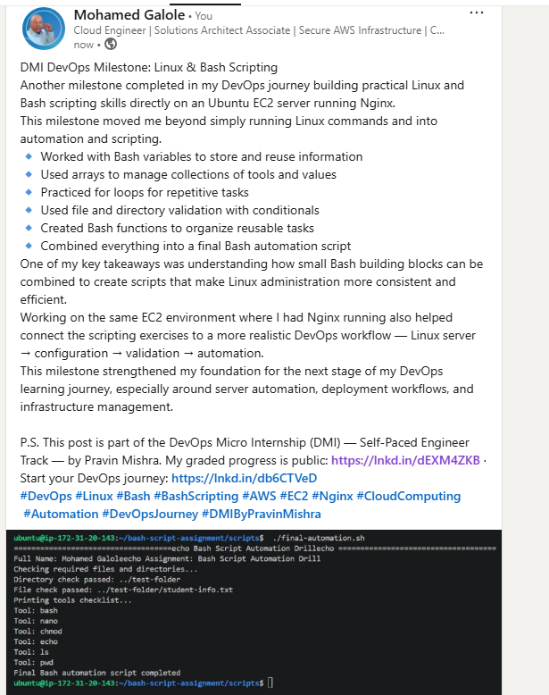

---

# Submission Instructions

- Add all required screenshots in your submission
- Full name must be visible in required screenshots
- All script files must be created and run successfully
- Required notes must be answered clearly for every task
- Do not expose sensitive information (keys, passwords, credentials)

---

# Completion Checklist

- [ ] Task 1: Environment setup verified, workspace created (Screenshots 1–2, Notes answered)
- [ ] Task 2: First script created, executed, permissions verified (Screenshots 1–3, Notes answered)
- [ ] Task 3: Variables script created and run (Screenshots 1–2, Notes answered)
- [ ] Task 4: Arrays and loops script created and run (Screenshots 1–2, Notes answered)
- [ ] Task 5: Counter loop script created and run (Screenshots 1–2, Notes answered)
- [ ] Task 6: File validation script created and run (Screenshots 1–3, Notes answered)
- [ ] Task 7: Pass/Retry conditional script tested with both values (Screenshots 1–4, Notes answered)
- [ ] Task 8: Final automation script created and run (Screenshots 1–3, Notes answered)
- [ ] All scripts run without errors
- [ ] Full Name visible in all required screenshots
- [ ] LinkedIn post published and URL submitted
- [ ] No sensitive data exposed

---

## 📌 About DMI & CloudAdvisory

DevOps Micro Internship (DMI) is a project-based DevOps program run by Pravin Mishra (The CloudAdvisory) focused on real-world execution, systems thinking, and career readiness.

It helps learners build strong DevOps foundations with hands-on experience.

---

## 📌 Resources

- 🌐 DMI Official Website: https://dmi.pravinmishra.com?utm_source=github&utm_medium=readme  
- 🎓 University: https://university.pravinmishra.com?utm_source=github&utm_medium=readme  
- 💬 Discord Community: https://discord.pravinmishra.com?utm_source=github&utm_medium=readme  
- 📝 Blog: https://dmi.pravinmishra.com/blog?utm_source=github&utm_medium=readme  
- ▶️ YouTube Playlist: https://www.youtube.com/playlist?list=PLFeSNDtI4Cho  
- 🔗 Pravin Mishra (LinkedIn): https://www.linkedin.com/in/pravin-mishra-aws-trainer/  
- 🏢 CloudAdvisory (LinkedIn): https://www.linkedin.com/company/thecloudadvisory/

---

*This submission is part of DevOps Micro Internship (DMI) Cohort 3 — Agentic AI Track.*